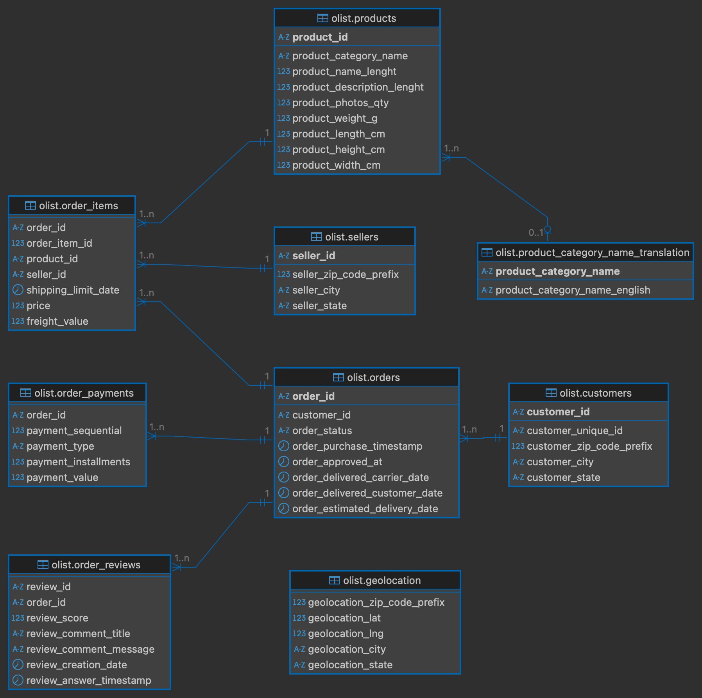
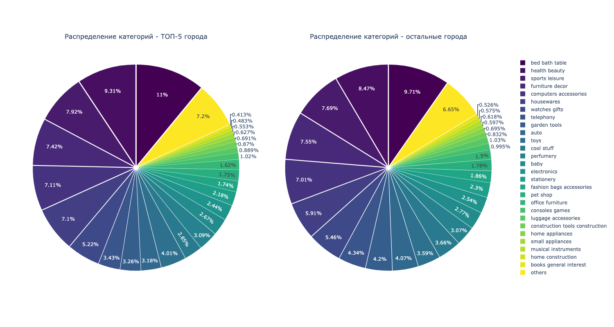
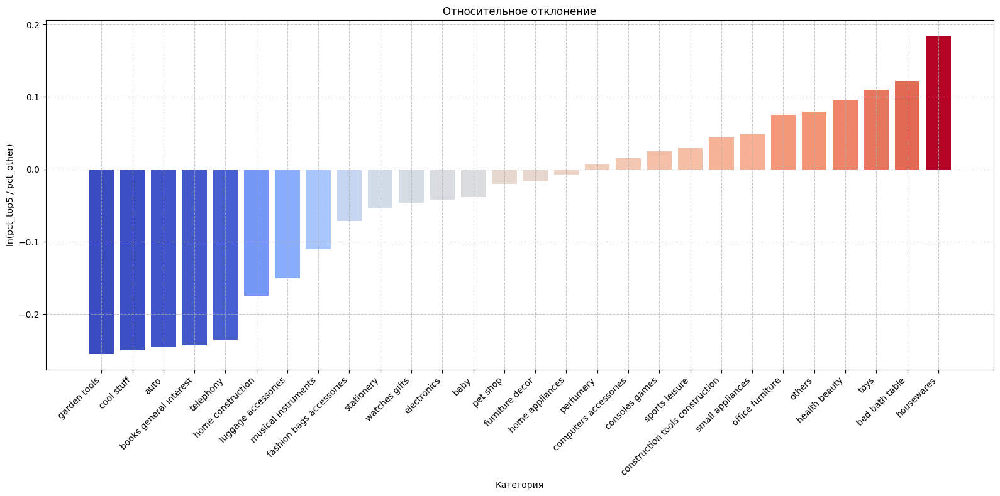
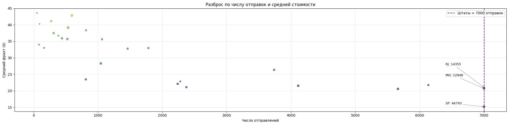
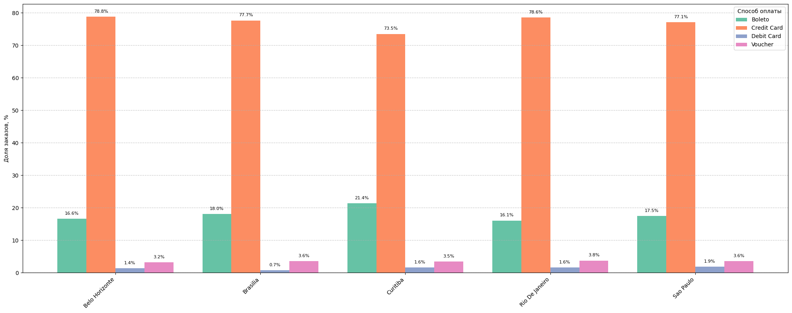

# Лабораторная работа по курсу Базы данных ([EN](#laboratory-work-on-the-course-databases-ru-) 🇬🇧)

##### **Цель работы:**
##### Освоить практические навыки SQL для аналитической обработки реального набора данных интернет магазина - `Olist`. Так как лабораторная работа имеет открытый формат выполнения, будем проводить аналз полученных результатов, составлять гипотезы, сравнивать показатели по регионам и категориям товаров, вычислять основные метрики и оформлять все в Jupyter Notebook.

---

❗️ **NOTE**: перед просмотром `lab_work.ipynb` настоятельно рекомендуется сделать `git clone` или скачать этот файл, чтобы открыть его локально, так как его полное содержимое не будет отображаться на git 

##### 1) [Описание](DB_2025_Bonus.pdf): иструкция по выполнению задания + 7 вариантов

##### 2) [Датасет](olist_dataset): Olist Brazilian E-Commerce

##### 3) [Подгототовка Датасета](lab_prepare.ipynb): Чистка данных, формирование DDL, заполнение таблиц

##### 4) [Выполнение Лабораторной работы](lab_work.ipynb): Ознакомление с датасетом, решение 1 варианта, вывод

---

[`scripts`](scripts) - SQL скрипты: Olist DDL; Перенос данных в схему olist; Запросы выполненого задания

[`images`](images) - изображения схемы и графиков полученных в `lab_work.ipynb`

[`geo-map`](images) - `geojson` коордианты стран и штатов Бразилии

---

Logical scheme:

Distribution of the total value of orders by territory of Brazil:

Distribution of product categories:

Relative deviation of product categories:

Variation in number of shipments and average cost:

Distribution of payment methods:

---

# Laboratory work on the course Databases ([RU](#лабораторная-работа-по-курсу-базы-данных-en-) 🇷🇺)

##### **Job Objective:**
##### To master the practical skills of SQL for analytical processing of a real data set of online store - `Olist`. Since the laboratory work has an open format of execution, we will analyze the results obtained, make hypotheses, compare indicators by regions and product categories, calculate the main metrics and formalize everything in Jupyter Notebook.

**PS:** This lab work was done in Russian language

---
   
❗️ **NOTE**: before viewing `lab_work.ipynb` it is strongly recommended to make a `git clone` or download this  file to open it locally, as its full contents will not be displayed on git

##### 1) [Description](DB_2025_Bonus.pdf): instructions on how to perform the task + 7 variants

##### 2) [Dataset](olist_dataset): Olist Brazilian E-Commerce

##### 3) [Dataset preparation](lab_prepare.ipynb): Data cleaning, DDL, table filling

##### 4) [Execution of Laboratory Work](lab_work.ipynb): Familiarizing with dataset, solving 1st variant, conclusion

---

[`scripts`](scripts) - SQL scripts: Olist DDL; Transfer of data to olist schema; Queries of completed work

[`images`](images) - images of the scheme and charts obtained in `lab_work.ipynb`.

[`geo-map`](images) - `geojson` coordinates of countries and states of Brazil

